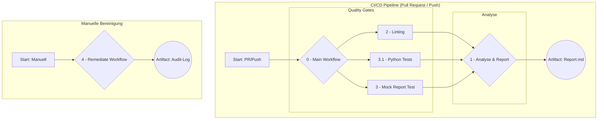

# Architektur-Konzept: Managed FinOps Service

**Dokumenten-ID:** `INT-ARCH-FINOPS-V1.0`   
**Status:** Entwurf   
**Datum:** 26.11.2025   

## 1. Vision & Leitprinzipien

### 1.1 Vision

Dieses Dokument beschreibt die technische Architektur des "Managed FinOps & Ressourcen-Optimierung"-Service. Das Ziel des Services ist es, die Azure-Cloud-Kosten für unsere Kunden proaktiv, sicher und nachvollziehbar durch einen hohen Automatisierungsgrad zu senken.

### 1.2 Leitprinzipien der Architektur

Die gesamte Lösung basiert auf den folgenden, nicht verhandelbaren Prinzipien, um maximale Sicherheit, Transparenz und Wiederholbarkeit zu gewährleisten.

*   **Workflow-First:** Die gesamte Logik ist in GitHub Actions Workflows gekapselt. Es gibt keine Abhängigkeiten zu externen Servern oder manuellen lokalen Ausführungen.
*   **Garantierte Ausführung:** Die Automatisierung ist so konzipiert, dass sie bei korrekter Konfiguration garantiert und vorhersagbar läuft. Die Ausführungsumgebung (`ubuntu-latest`) ist standardisiert und nicht von lokalen Maschinen abhängig.
*   **Sicherheit durch minimale Berechtigungen (Least Privilege):** Jeder Workflow erhält nur die minimal notwendigen Berechtigungen für seine spezifische Aufgabe. Lesende und schreibende/löschende Operationen sind strikt getrennt.
*   **Sicherheit durch explizite Trigger:** Automatisierte, ändernde Eingriffe in die Kundenumgebung sind ausgeschlossen. Jede potenziell destruktive Aktion erfordert einen expliziten, manuellen Trigger durch einen autorisierten Benutzer.
*   **Transparenz und Auditierbarkeit:** Jeder Schritt, jede Analyse und jede Änderung wird protokolliert und ist über die GitHub Actions Logs und die erzeugten Artifacts jederzeit nachvollziehbar.

---
## 2. Gesamtarchitektur: Die 2-Workflow-Struktur

Die Service-Architektur nutzt ein **Orchestrator-Pattern**, um maximale Modularität, Testbarkeit und klare Abhängigkeiten zu gewährleisten. Ein zentraler "Main"-Workflow ruft eine Reihe von untergeordneten, wiederverwendbaren Workflows auf.

**Diagramm des Prozesses:**

### 2.1 Der Orchestrator und die Quality Gates: `0-main-workflow.yml`

*   **Zweck:** Dient als zentraler Einstiegspunkt für die automatisierte CI/CD-Pipeline. Er selbst enthält keine ausführende Logik, sondern delegiert diese an die wiederverwendbaren Workflows.
*   **Trigger:** `push` (auf Feature-Branches), `pull_request` (auf `main`) und `workflow_dispatch` (manuell).
*   **Logik:**
    1.  Startet die drei "Quality Gate"-Workflows (Linting, Python-Tests, Mock-Report-Test).
    2.  Wartet auf deren erfolgreichen Abschluss (`needs: [...]`).
    3.  Startet erst dann den Haupt-Analyse-Workflow (`1-analyze-and-report.yml`).

* **Qualiti-Gate-Workflows**
    *   **`2-lint-workflows.yml` (Linting):**
        *   **Zweck:** Stellt als Quality Gate sicher, dass alle Workflow-Dateien eine gültige Syntax haben (`actionlint`).

    *   **`3-mock-test-report-generation.yml` (Mock-Report-Test):**
        *   **Zweck:** Stellt als Quality Gate sicher, dass die Report-Generierung (`generate-report.sh`) korrekt funktioniert, indem es gefälschte Analysedaten (`create-mock-data.sh`) verwendet.

    *   **`3.1-python-tests.yml` (Python Unit-Tests):**
        *   **Zweck:** Stellt als Quality Gate sicher, dass alle in Python geschriebenen Analyse-Module (z.B. für unterauslastete VMs) ihre logischen Tests bestehen.

### 2.2 Haupt-Workflows: Analyse & Reporting (`1-analyze-and-report.yml`)

*   **Zweck:** Dieser Workflow kombiniert die Analyse und das Reporting in einer einzigen, orchestrierten Ausführung. Er ist der primäre Workflow für die Datensammlung und Aufbereitung.
*   **Struktur:** Er besteht aus zwei Jobs, die nacheinander ausgeführt werden:
    1.  **Job `analyze`:** Führt ausschließlich lesende Operationen auf Azure durch, um Einsparpotenziale zu identifizieren. Er nutzt einen Service Principal mit **"Leser" (Reader)**-Rechten. Sein Ergebnis (mehrere `.tsv`-Dateien) wird als Artefakt (`finops-analysis-results`) hochgeladen.
    2.  **Job `report`:** Wartet auf den erfolgreichen Abschluss des `analyze`-Jobs (`needs: analyze`). Er lädt das Artefakt herunter, verarbeitet die Rohdaten mit dem `generate-report.sh`-Skript und lädt den fertigen Markdown-Bericht als Artefakt (`finops-cost-report`) hoch.
*   **Trigger:** Wird vom Orchestrator aufgerufen (`on: workflow_call`) oder kann für isolierte Tests manuell gestartet werden (`on: workflow_dispatch`).

### 2.3 Manueller Workflow: Remediation (`4-remediate-resources.yml`)

*   **Zweck:** Führt aktive, ändernde Operationen (z.B. das Löschen von Ressourcen) durch und ist durch mehrere Sicherheitsstufen strikt abgesichert. Dieser Workflow ist bewusst vom CI/CD-Prozess entkoppelt.
*   **Struktur:** Er besteht aus zwei Jobs, die sich gegenseitig ausschließen und auf unterschiedliche Trigger reagieren:
    1.  **Job `on-push-validation`:** Läuft **nur** bei einem `push`-Event. Er führt einen sicheren "Verbindungstest" durch, indem er sich mit den hochprivilegierten `WRITE`-Credentials anmeldet, um deren Korrektheit zu validieren, ohne Änderungen vorzunehmen.
    2.  **Job `manual-remediation`:** Läuft **nur** bei einem manuellen `workflow_dispatch`-Event. Er führt die eigentliche Bereinigung durch, geschützt durch manuelle Inputs (Auswahl des Ressourcentyps, Bestätigungsphrase).
*   **Authentifizierung:** Nutzt eine **separate, hochprivilegierte App-Registrierung** mit schreibenden Berechtigungen (z.B. "Contributor"), deren Zugangsdaten in `AZURE_WRITE_*`-Secrets gespeichert sind.
*   **Output:** Erstellt ein detailliertes Audit-Log (`remediation-log.txt`) und lädt dieses als Artefakt hoch.

---

## 3. Implementierungs-Details: Analyse-Module

Dieses Kapitel beschreibt die konkreten technischen Logiken, die im Analyse-Workflow zur Identifizierung von Einsparpotenzialen verwendet werden.

### 3.1 Modul: Verwaiste Ressourcen

*   **Ziel:** Identifiziere Ressourcen, die Kosten verursachen, aber keiner aktiven Hauptressource mehr zugeordnet sind.
*   **3.1.1 Verwaiste Festplatten (Unattached Disks)**
    *   **Logik:** `az disk list --query "[?diskState=='Unattached']"`
    *   **Output-Datei:** `analysis-unattached-disks.tsv`
*   **3.1.2 Ungenutzte öffentliche IP-Adressen (Unassociated Public IPs)**
    *   **Logik:** `az network public-ip list --query "[?ipConfiguration==null]"`
    *   **Output-Datei:** `analysis-unassociated-public-ips.tsv`
*   **3.1.3 Verwaiste Netzwerkschnittstellen (Detached NICs)**
    *   **Logik:** `az network nic list --query "[?virtualMachine==null]"`
    *   **Output-Datei:** `analysis-detached-nics.tsv`

### 3.2 Modul: Überdimensionierte Ressourcen (Right-Sizing)

*   **Ziel:** Identifiziere Ressourcen, deren gebuchte Leistung signifikant höher ist als die tatsächliche Nutzung.
*   **3.2.1 Überdimensionierte VMs (CPU)**
    *   **Logik:** Abfrage von Azure Monitor Metriken (`az monitor metrics list`) für `Percentage CPU` über die letzten 30 Tage. Filtere VMs, deren durchschnittliche oder maximale Auslastung unter einem Schwellenwert (z.B. `avg < 15%`) liegt.
    *   **Output-Datei:** `analysis-downsize-vm-candidates.tsv`
*   **3.2.2 Unterausgelastete App Service Pläne**
    *   **Logik:** Abfrage von Azure Monitor Metriken für `CpuPercentage` und `MemoryPercentage` des App Service Plans. Filtere Pläne, die konstant unterausgelastet sind.
    *   **Output-Datei:** `analysis-downsize-asp-candidates.tsv`

### 3.3 Modul: Ungenutzte oder veraltete Ressourcen

*   **Ziel:** Identifiziere Ressourcen, die seit langer Zeit nicht mehr genutzt werden oder durch veraltete Konfigurationen ein Risiko darstellen.
*   **3.3.1 Alte Snapshots von VMs**
    *   **Logik:** `az snapshot list --query "[?timeCreated < '$(date -d '-90 days' -u +'%Y-%m-%dT%H:%M:%SZ')']"`
    *   **Output-Datei:** `analysis-old-snapshots.tsv`
*   **3.3.2 Leere Ressourcengruppen**
    *   **Logik:** Iteriere durch alle Ressourcengruppen (`az group list`) und prüfe für jede Gruppe die Anzahl der enthaltenen Ressourcen (`az resource list --resource-group [RG_NAME]`). Filtere Gruppen mit 0 Ressourcen.
    *   **Output-Datei:** `analysis-empty-resource-groups.tsv`
*   **3.3.3 Veraltete App Service TLS/SSL-Einstellungen**
    *   **Logik:** `az webapp list --query "[?httpsSettings.minTlsVersion!='1.2']"`
    *   **Output-Datei:** `analysis-outdated-tls-settings.tsv`

### 3.4 Modul: Azure Advisor Empfehlungen

*   **Ziel:** Systematische Sammlung und Kategorisierung der von Azure selbst generierten Empfehlungen.
*   **Logik:** `az advisor recommendation list --query "[?category=='Cost' || category=='HighAvailability']"`
*   **Output-Datei:** `analysis-azure-advisor-recommendations.tsv`
